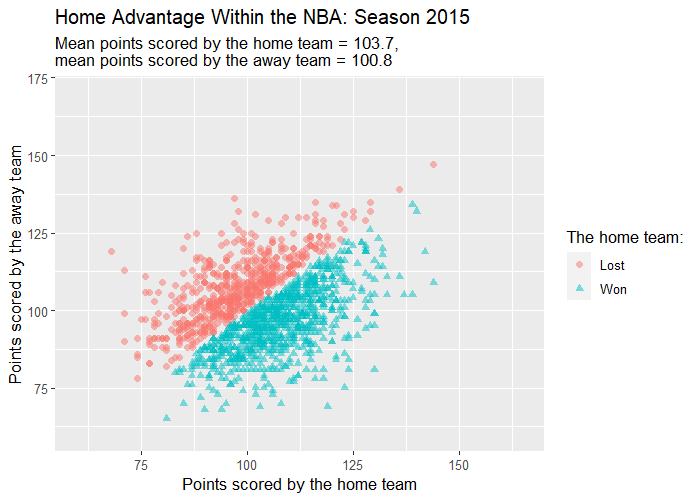

```{r setup, include=FALSE}

knitr::opts_chunk$set(echo = TRUE)

```
Please ensure you have installed:  
* [R](https://cran.r-project.org/mirrors.html)  
* [Rstudio](https://www.rstudio.com/products/rstudio/download/)  
* [Rtools40](https://clanfear.github.io/CSSS508/docs/compiling.html) for Windows or [Xcode Command Line Tools](https://clanfear.github.io/CSSS508/docs/compiling.html) for Mac  
* Git (for [Windows](https://git-scm.com/download/win) or [Mac](https://git-scm.com/download/mac))  
* [MikTex](https://miktex.org/download)  

For my GitHub repository please click [here](https://github.com/RoosvanVelthoven/roos_van_velthoven_psy6422_200256845)  
* Please clone my git repository  
* Please open index.Rmd  
* Please enter renv::restore()  
* Please enter y  

*Please utilize the above steps to restore the project library, locally, on your machine.*

```{r, include = FALSE}

# Packages
library(here)
library(tidyverse)
library(animation)
library(png)
library(grid)

```

# Research Question  

When sports are played with a balanced home and away schedule, the home team wins over 50% of their matches (Courneya & Carron, 1992).  

For the PSY6422 assignment I am visualising home advantage within the National Basketball Association (NBA) from the 2015 season till the 2018 season.  

The visualisation will aim to address the following question:  

**Do home teams, on average, score more points than away teams?**  

\**Season span: season 2015 (2015-2016), season 2016 (2016-2017), season 2017 (2017-2018) and season 2018 (2018-2019)*

\**Data from subsequent seasons are excluded, the COVID-19 pandemic may have influenced home advantage (e.g., through crowd restrictions)*    

# Data Origin  

The data set **games.csv** was obtained through [Kaggle](https://www.kaggle.com/nathanlauga/nba-games), the data set was published by Nathan Lauga.  

The data was collected from the [NBA statistics website](https://www.nba.com/stats/), please click [here](https://github.com/Nathanlauga/nba-predictor) for more information (and please click [here](https://github.com/swar/nba_api/blob/master/docs/table_of_contents.md) for more information on Application Programming Interface (API) endpoints).  

The data set contains NBA games from 05/10/2003 till present (the data is updated periodically; the expected update frequency is quarterly).  

To particularise, the data set contains information on  game date,  game ID, game status (final means that the game was completed), home team ID, visitor team ID, **season**, team ID of the home team, **points scored by the home team**, field goal percentage of the home team,  free throw percentage of the home team, three-point percentage of the home team, assists of the home team, rebounds of the home team, team ID of the away team, **points scored by the away team**, field goal percentage of the away team, free throw percentage of the away team, three-point percentage of the away team, assists of the away team, rebounds of the away team and **wins of the home team**.  

```{r}

# Code to read in games.csv
nba_raw <- read.csv(here("data", "raw", "games.csv"))
# nba_raw = raw data

```

<div style="text-align: center;" markdown="1">
Of interest, to the current assignment, are the variables in **bold**.
</div>  
<div style="text-align: center;" markdown="1">
<style>
div.Dark_Cornflower_Blue { background-color:#17408B; border-radius: 2px; padding: 2px;}
</style>
<div class = "Dark_Cornflower_Blue">
_<span style="color:white"> First three rows of the raw data: </span>  _
</div>
</div>

```{r, echo = FALSE}

head(nba_raw, 3) # code to call first 3 lines of data

```
# Data Preparation  
```{r, relabelled data frame}

# Code to specify which variables to keep
nba_variables <-  nba_raw %>% 
  select(SEASON, PTS_home, PTS_away, HOME_TEAM_WINS) 
# nba_variables = data of solely the variables of interest

# Code to rename columns for easy labelling
nba_relabelled <- nba_variables %>%
  rename(points_home = "PTS_home", points_away = "PTS_away", season = "SEASON",
         home_win = "HOME_TEAM_WINS")

# Code to recode home_win values 1 to won and 0 to lost
nba_relabelled[nba_relabelled == "1"] <- "Won"
nba_relabelled[nba_relabelled == "0"] <- "Lost"

# nba_relabelled = data with relabelled variables and recoded home_win values (1 = won and 0 = lost)

# Code to save the relabelled data frame
write.csv(nba_relabelled, file = here("data", "processed", "nba_relabelled.csv"))

```

```{r, 2018-2015 dataframe}

# Code to specify which seasons to keep
nba_2018_2015 <- nba_relabelled[ !(nba_relabelled$season %in% c(2020:2019, 2014:2003)), ]
# nba_2018_2015 = data of the 2015-2018 seasons

# Code to save nba_2018_2015 as a csv file (I need this later for my min and max values)
write.csv(nba_2018_2015, file = here("data", "processed", "nba_2018_2015.csv"))

```

``` {r, nba_final_df}

# Code to keep season 2018
nba18 <- nba_2018_2015[ !(nba_2018_2015$season %in% c(2020:2019, 2017:2003)), ]
# nba18 = data of solely the 2018 season

# Code to rename columns for easy labelling when data frames are combined
nba18 <- nba18 %>% rename(points_home_18 = "points_home", points_away_18 = "points_away", season_18 = "season", home_win_18 = "home_win")

```
The above process was repeated to create nba17, nba16 and nba15 data frames.
```{r, include = FALSE}

nba17 <- nba_2018_2015[ !(nba_2018_2015$season %in% c(2020:2018, 2016:2003)), ]
# nba17 = data of solely the 2017 season

# Code to rename columns for easy labelling when data frames are combined
nba17 <- nba17 %>% rename(points_home_17 = "points_home", points_away_17 = "points_away", season_17 = "season", home_win_17 = "home_win")

nba16 <- nba_2018_2015[ !(nba_2018_2015$season %in% c(2020:2017, 2015:2003)), ]
# nba16 = data of solely the 2016 season

# Code to rename columns for easy labelling when data frames are combined
nba16 <- nba16 %>% rename(points_home_16 = "points_home", points_away_16 = "points_away", season_16 = "season", home_win_16 = "home_win")

nba15 <- nba_2018_2015[ !(nba_2018_2015$season %in% c(2020:2016, 2014:2003)), ]
# nba15 = data of solely the 2015 season

# Code to rename columns for easy labelling when data frames are combined
nba15 <- nba15 %>% rename(points_home_15 = "points_home", points_away_15 = "points_away", season_15 = "season", home_win_15 = "home_win")

```

```{r}

# Code to add ID numbers, I need specific keys to merge my data frames
nba18 <- nba18 %>% mutate(id = row_number())
nba17 <- nba17 %>% mutate(id = row_number())
nba16 <- nba16 %>% mutate(id = row_number())
nba15 <- nba15 %>% mutate(id = row_number())

# Each data frame has a different number of games, to merge the data frames without
# losing data, I need to do a full(outer) join. 

# Code to merge nba18 and nba17, I can only merge two data frames with this code
full18_17 <- merge(nba18, nba17, by = "id", all = TRUE)

# Code to merge nba16 and nba15
full16_15 <- merge(nba16, nba15, by = "id", all = TRUE)

# Code to merge full18_17 and full16_15
full18_15 <- merge(full18_17, full16_15, by = "id", all = TRUE)

# Time to rename my data frame to reduce confusion
nba_final_df <- full18_15

# Code to remove the season columns
nba_final_df <- select(nba_final_df,-season_18, -season_17, -season_16, -season_15)

# Code to save my final data set as a csv file
write.csv(nba_final_df, file = here("data", "processed", "nba_final_df.csv"))
# nba_final_df = data set that I will use for my plots

```

```{r, include = FALSE}

# Some extra checks to ensure that I have all my data.

# Code to determine the max value of a column
max(nba18$id) 
## [1] 1378

max(nba17$id)
## [1] 1382

max(nba16$id)
## [1] 1405

max(nba15$id)
## [1] 1416

max(nba_final_df$id)
## [1] 1416
# All the data points are still there!

```
<div style="text-align: center;" markdown="1">
<style>
div.Philippine_Red { background-color:#C9082A; border-radius: 2px; padding: 2px;}
</style>
<div class = "Philippine_Red">
_<span style="color:white"> First three rows of the processed data: </span>  _
</div>
</div>  
```{r, echo = FALSE}

head(nba_final_df, 3)

```
# Visualisation of the 2015, 2016, 2017 and 2018 Season  
```{r}

# Step one: I need two lists of variables to iterate over
points_home <- c("points_home_15","points_home_16","points_home_17","points_home_18")
points_away <- c("points_away_15","points_away_16","points_away_17","points_away_18") 

# Step two: I need a list of variables for my colour and shape
home_win <- c("home_win_15","home_win_16","home_win_17","home_win_18") 

# Step three: I need a list of titles
season <- c("Home Advantage Within the NBA: Season 2015", "Home Advantage Within the NBA: Season 2016", "Home Advantage Within the NBA: Season 2017", "Home Advantage Within the NBA: Season 2018")

# Step four: I need plot parameters
xlab  <-  'Points scored by the home team'
ylab  <-  'Points scored by the away team'
pointsize  <-  2
alpha <- .5
h <- "The home team:"

```

```{r, results = 'hide'}

# Step five: I need xlim and ylim values
min(nba_2018_2015$points_home) ## [1] 64
max(nba_2018_2015$points_home) ## [1] 161
# I will use 60 - 165 for my xlim
min(nba_2018_2015$points_away) ## [1] 65
max(nba_2018_2015$points_away) ## [1] 168
# I will use 60 - 170 for my ylim

```

```{r, warning = FALSE, message = FALSE, results = 'hide'}

# Step six: I need a loop to look at points_away and points_home across four seasons

# Code to start saving my GIF
saveGIF({
# Code to start my loop
  for (i in 1:4){

  mx <- mean(nba_final_df[,points_home[i]], na.rm = TRUE)
# This will be used for my subtitle, it determines the mean value of points scored by the home team in a certain season and then assigns it to an object.   
# na.rm = TRUE removes missing values in the calculation
  my <- mean(nba_final_df[,points_away[i]], na.rm = TRUE)
# This will be used for my subtitle, it determines the mean value of points scored by the away team in a certain season and then assigns it to an object.

    nba_plots <- 
      ggplot(data = nba_final_df,
           mapping = aes_string (x = points_home[i],
# First lists of variables to iterate over
                                 y =   points_away[i], 
# Second lists of variables to iterate over
                                 colour = home_win[i], 
# Code to have different colours for games won or lost by the home team
                                 shape = home_win[i])) 
# Code to have different shapes for games won or lost by the home team
  
# Step seven: time to add plot parameters
    p <- nba_plots +
              geom_point (size = pointsize, alpha = alpha) +
                    labs(x = xlab, y = ylab, title = season[i], 
                         subtitle = sprintf("Mean points scored by the home team = %.1f, 
mean points scored by the away team = %.1f", mx,my)) +
                    xlim(60, 165) +
                    ylim(60, 170) +
                    scale_colour_discrete(h, na.translate = FALSE) + 
# Code necessary to have different colours for games won or lost by the home team
                    scale_shape_discrete(h, na.translate=FALSE) +
# Code necessary to have different shapes for games won or lost by the home team
                    theme(text = element_text(size = 12))
# Code to set text to size 12
            
        ggsave(filename = paste("figs/nba",toString(i),".png",sep=""))
# Code to save the plots (nba1.png, nba2.png, nba3.png and nba4.png)
          
  print(p)}
  
},interval = 8,                            # 8 seconds interval
  movie.name = "visualisation.gif",        
  ani.height = 500,                        
  ani.width = 700, 
  ani.res = 100)                           # Resolution
# My GIF was saved as visualisation.gif

```

**Do home teams, on average, score more points than away teams?** 

```{r, echo = FALSE}

# Code necessary to exhibit my gif in my index.html


```

```{r, echo = FALSE, results='hide'}

# Code to save a copy of my GIF in my figs folder
file.copy("visualisation.gif", here("figs"), overwrite = TRUE)

```

The home team scores, on average, more than the away team (please see the subtitle).

However, the number of games won by the home team (blue) and the away team (red) appears very similar. The impact of home advantage may, thus, not be very large.

\**Please allow eight seconds for the graph to update*  

# Summary
In sum, the visualisation shows that, although the home team, on average, scores more points than the away team, the difference is not large; the visualisation suggests that the number of points scored by home teams and away teams are similar. When exploring home advantage data, it may, thus, be useful to visualise variables.

If I had more time, I would create an interactive web application, through the shiny package. I would like to give users the opportunity to decide which season to look at.
Moreover, I would have visualised additional variables (e.g., fouls, three throws or home win ratios) to explore how they impact home advantage.
Lastly, I would have compared visualisations of a pre-Covid-19 season with visualisations of a Covid-19 season. To explore if the Covid-19 pandemic influenced home advantage.


# Appendix 
- Non-animated visualisation of the 2015 season  
```{r, fig.height= 5.00, fig.width= 7.00, echo = FALSE}

# Code to display a png
image_nba1 <- readPNG(here("figs", "nba1.png"))
grid.raster(image_nba1)

```

- Non-animated visualisation of the 2016 season  
```{r, fig.height= 5.00, fig.width= 7.00, echo = FALSE}

image_nba2 <- readPNG(here("figs", "nba2.png"))
grid.raster(image_nba2)

```

- Non-animated visualisation of the 2017 season  
```{r, fig.height= 5.00, fig.width= 7.00, echo = FALSE}

image_nba3 <- readPNG(here("figs", "nba3.png"))
grid.raster(image_nba3)

```

- Non-animated visualisation of the 2018 season  
```{r, fig.height= 5.00, fig.width= 7.00, echo = FALSE}

image_nba4 <- readPNG(here("figs", "nba4.png"))
grid.raster(image_nba4)

```